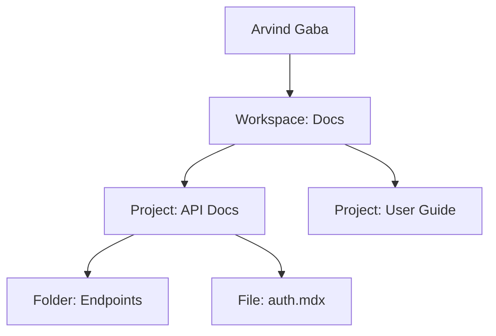

## Overview

Arvind Gaba provides a flexible documentation platform where you organize projects into workspaces, manage content with version control, and control access through granular permissions. Master these concepts to streamline your documentation workflow.

<Columns cols={3}>
  <Card title="Workspaces" icon="layers" href="#project-structures">
    Group related projects and set permissions at the workspace level.
  </Card>
  <Card title="Version Control" icon="git-branch" href="#version-control">
    Track changes with Git integration for seamless collaboration.
  </Card>
  <Card title="Content Types" icon="file-text" href="#content-types">
    Support Markdown, MDX, and custom formats with rich components.
  </Card>
</Columns>

## Project Structures and Workspaces

Workspaces act as containers for your projects. You create a workspace to group documentation for a specific product or team, then add projects inside it. Each workspace supports unlimited projects and nested folders.



<Steps>
  <Step title="Create Workspace" icon="plus">
    Navigate to the dashboard and click "New Workspace". Enter a name like "MyProjectDocs".
  </Step>
  <Step title="Add Project" icon="folder">
    Inside the workspace, select "New Project" and choose a template.
  </Step>
  <Step title="Organize Files" icon="file">
    Drag and drop MDX files into folders for structured navigation.
  </Step>
</Steps>

<Callout kind="tip">
  Use workspaces to separate environments like staging and production docs.
</Callout>

## Version Control Basics

Integrate Git repositories directly into Arvind Gaba. You connect your repo, and changes sync automatically. This enables branching, pull requests, and history tracking without leaving the platform.

<CodeGroup tabs="Git Bash,CLI">
  ````bash
  git init arvind-docs
  cd arvind-docs
  git remote add origin https://github.com/yourusername/arvind-docs.git
  git add .
  git commit -m "Initial docs commit"
  git push -u origin main
  ````

  ````bash
  # Connect repo in Arvind Gaba dashboard
  # Paste your GitHub repo URL
  # Enable auto-sync for webhook updates
  ````
</CodeGroup>

Branching lets you draft changes safely:

```javascript
// Example: Create a feature branch
git checkout -b feature/new-components
// Edit files, commit, and open PR
```

## Content Types and Formatting

Arvind Gaba supports multiple content formats. Use Markdown for simple pages and MDX for interactive components like tabs and code groups.

<Tabs>
  <Tab title="Markdown" icon="file">
    Standard Markdown renders headings, lists, and code blocks.

    ```
    # Heading
    - List item
    ```

    Ideal for static guides.
  </Tab>
  <Tab title="MDX" icon="code">
    Embed JSX components for rich experiences.

    ````jsx
    <Callout kind="info">
      Interactive content.
    </Callout>
    ````

    Perfect for tutorials with code examples.
  </Tab>
</Tabs>

## Permissions and Access Levels

Control who views and edits your docs with role-based access.

| Role       | View | Edit | Admin |
|------------|------|------|-------|
| Guest      | ✅   | ❌   | ❌    |
| Editor     | ✅   | ✅   | ❌    |
| Owner      | ✅   | ✅   | ✅    |

<Callout kind="alert">
  Always assign the minimum permissions needed. Review access monthly.
</Callout>

<Expandable title="Advanced Permissions" default-open="false">
  Use workspace-level invites with expiration dates. Integrate with SSO for enterprise teams.
</Expandable>

Ready to apply these concepts? Check [Quickstart](/quickstart) for hands-on setup.